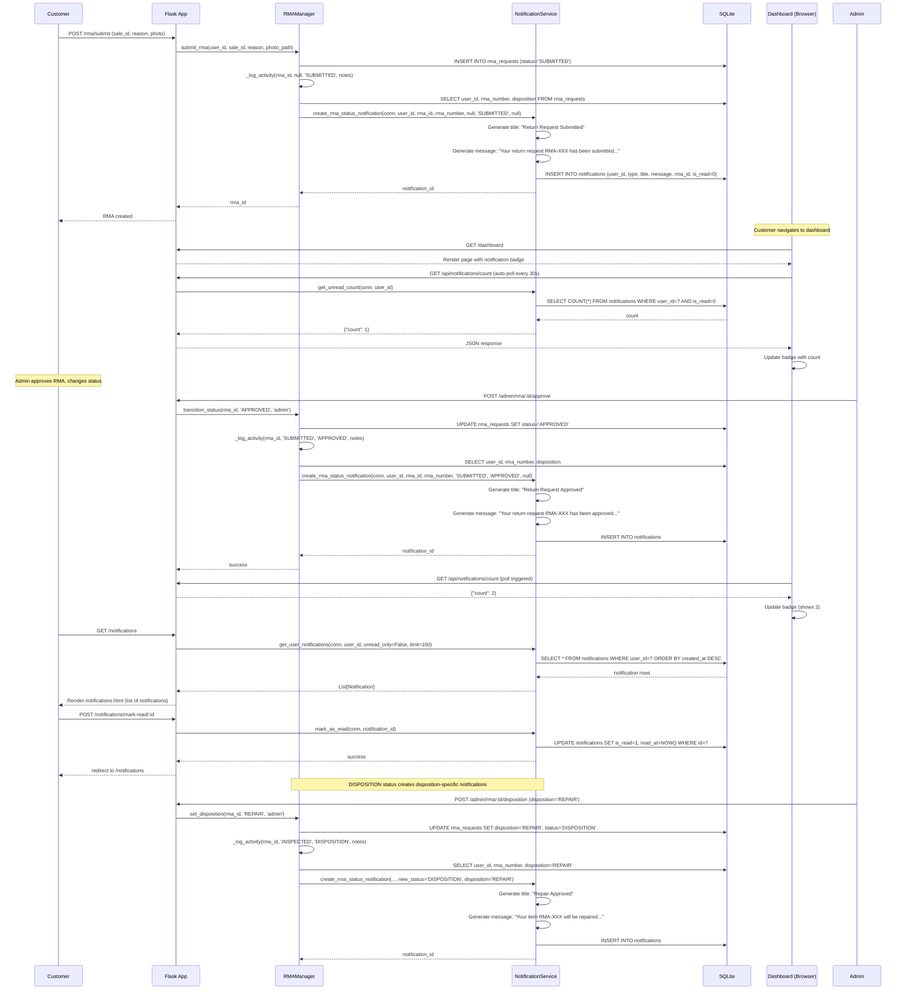
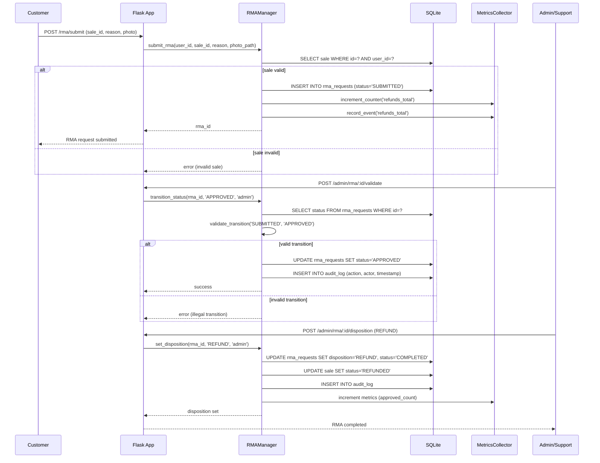
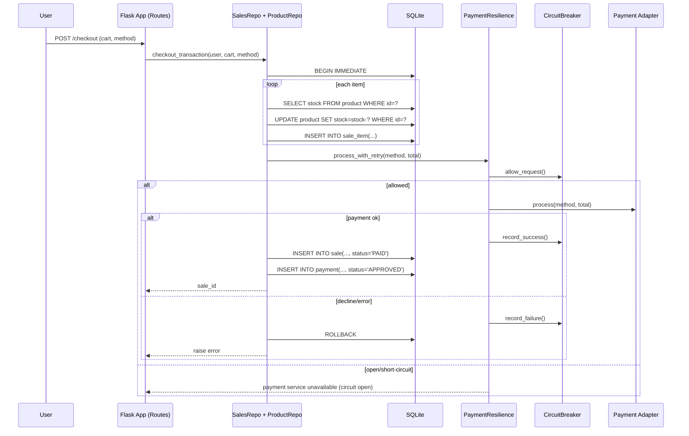
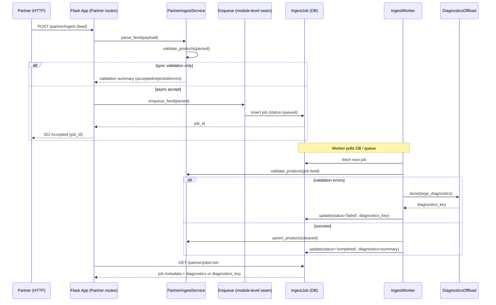
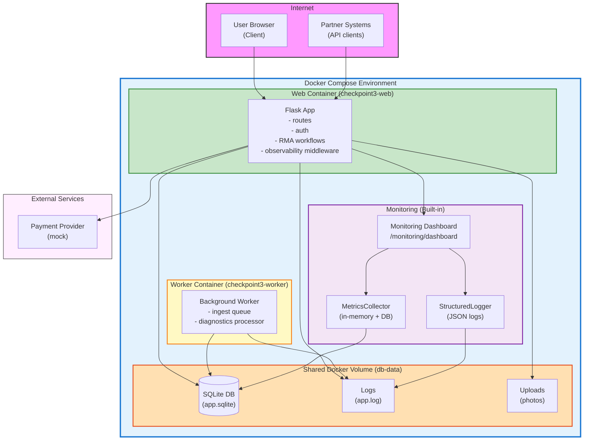
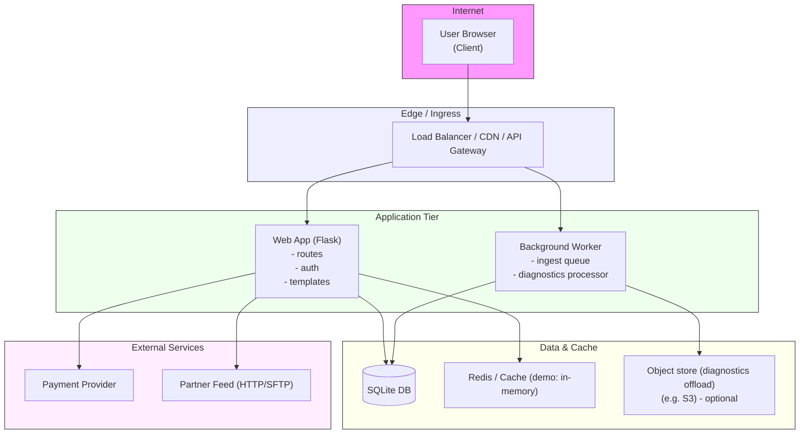
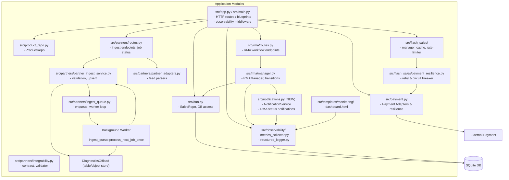
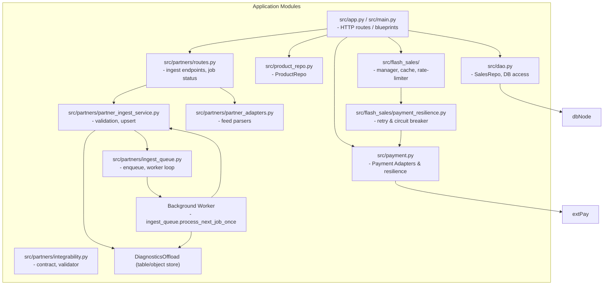

# UML Diagrams - Checkpoint 4

This document presents the 4+1 Architectural Views for the complete retail system, including Flash Sales, Partner Integration, **RMA (Returns & Refunds)**, **Observability**, **Order Filtering & Search**, **Low Stock Alerts**, and **RMA Notifications** modules.

---

## Logical View: Class Diagram

```mermaid
classDiagram
    %% ====== FLASH SALES MODULE ======
    
    %% Core Business Logic
    class FlashSaleManager {
        -conn: Connection
        +is_flash_sale_active(product_id: int) bool
        +get_effective_price(product_id: int) int
        +get_flash_products() List~Product~
        +log_event(product_id: int, event_type: str, details: str)
    }

    %% Performance Tactics
    class RateLimiter {
        -max_requests: int
        -window_seconds: int
        -requests: Dict
        -lock: Lock
        +is_allowed(identifier: str) bool
        +reset(identifier: str)
        +get_remaining(identifier: str) int
    }

    class SimpleCache {
        -default_ttl: int
        -cache: Dict
        -lock: Lock
        +get(key: str) Any
        +set(key: str, value: Any, ttl: int)
        +delete(key: str)
        +clear()
    }

    %% Availability Tactics
    class CircuitBreaker {
        -failure_threshold: int
        -timeout_seconds: int
        -state: CircuitState
        -failure_count: int
        +call(func: Callable) Any
        +record_success()
        +record_failure()
        +reset()
        +get_state() CircuitState
    }

    class CircuitState {
        <<enumeration>>
        CLOSED
        OPEN
        HALF_OPEN
    }

    class RetryDecorator {
        <<function>>
        +retry(max_attempts, delay_seconds, exceptions)
    }

    class PaymentResilience {
        -circuit_breaker: CircuitBreaker
        +process_payment_with_retry(method: str, amount_cents: int) Tuple
    }

    %% ====== PARTNER INTEGRATION MODULE ======
    
    class PartnerIngestService {
        -conn: Connection
        +validate_products(feed) ValidationResult
        +enqueue_feed(feed) JobId
    }

    class PartnerAdapter {
        +parse_feed(payload, content_type) List~Product~
    }

    class IngestQueue {
        +insert_job(status: str) JobId
        +fetch_next_job_once() Job
    }

    class IngestWorker {
        +process_next_job_once()
        +validate_products(job_feed)
        +store_diagnostics(diagnostics)
    }

    class DiagnosticsOffload {
        +store(blob: bytes) str
        +retrieve(key: str) bytes
    }

    class AuthMiddleware {
        +verify_api_key(key: str) bool
    }

    class InputValidator {
        +validate_feed(data) ValidationResult
        +sanitize_input(data) str
    }

    %% ====== RMA (RETURNS & REFUNDS) MODULE ======
    
    class RMAManager {
        -conn: Connection
        +submit_rma(user_id: int, sale_id: int, reason: str, photo_path: str) RMARequest
        +get_user_rmas(user_id: int) List~RMARequest~
        +transition_status(rma_id: int, new_status: str, actor: str)
        +set_disposition(rma_id: int, disposition: str, actor: str)
        +validate_transition(current: str, new: str) bool
    }

    class RMARequest {
        +id: int
        +user_id: int
        +sale_id: int
        +status: str
        +disposition: str
        +reason: str
        +photo_path: str
        +created_at: datetime
        +updated_at: datetime
    }

    class RMADisposition {
        <<enumeration>>
        REFUND
        REPLACEMENT
        REPAIR
        STORE_CREDIT
        REJECT
    }

    class RMAStatus {
        <<enumeration>>
        SUBMITTED
        VALIDATING
        APPROVED
        SHIPPING
        RECEIVED
        INSPECTING
        INSPECTED
        DISPOSITION
        PROCESSING
        COMPLETED
        CANCELLED
    }
    
    %% ====== NOTIFICATIONS MODULE (NEW) ======
    
    class NotificationService {
        +create_rma_status_notification(conn, user_id, rma_id, rma_number, old_status, new_status, disposition) int
        +get_user_notifications(conn, user_id, unread_only, limit) List~Notification~
        +get_unread_count(conn, user_id) int
        +mark_as_read(conn, notification_id) bool
        +mark_all_as_read(conn, user_id) int
    }
    
    class Notification {
        +id: int
        +user_id: int
        +type: str
        +title: str
        +message: str
        +rma_id: int
        +rma_number: str
        +is_read: bool
        +created_at: datetime
        +read_at: datetime
    }

    %% ====== OBSERVABILITY MODULE ======
    
    class MetricsCollector {
        -counters: Dict
        -gauges: Dict
        -histograms: Dict
        +increment_counter(name: str, value: int, labels: Dict)
        +set_gauge(name: str, value: float, labels: Dict)
        +observe(name: str, value: float, labels: Dict)
        +get_business_metrics() Dict
        +get_histogram_stats(name: str) Dict
    }

    class StructuredLogger {
        -log_level: str
        +info(message: str, **context)
        +warning(message: str, **context)
        +error(message: str, **context)
        +critical(message: str, **context)
    }

    class MonitoringDashboard {
        +get_metrics() Dict
        +get_recent_logs() List
        +get_system_health() Dict
    }

    %% ====== SHARED MODULES ======
    
    class ProductRepo {
        -conn: Connection
        +get_all_products() List~Product~
        +search_products(query: str) List~Product~
        +get_product(id: int) Product
        +check_stock(id: int, qty: int) bool
        +get_low_stock_products(threshold: int) List~Product~
    }

    class AProductRepo {
        -conn: Connection
        +get_all_products() List~Product~
        +get_product(id: int) Product
        +check_stock(id: int, qty: int) bool
        +get_low_stock_products(threshold: int) List~Product~
    }

    class SalesRepo {
        -conn: Connection
        +checkout_transaction(user_id, cart, method, payment_cb)
        +create_sale(user_id, cart, payment_info)
    }

    class PaymentAdapter {
        +process(method: str, total: int) Tuple
    }

    %% ====== RELATIONSHIPS ======
    
    %% Flash Sales relationships
    FlashSaleManager --> ProductRepo : uses
    FlashSaleManager --> SimpleCache : caches results
    ProductRepo <|-- AProductRepo : inherits
    
    SalesRepo --> PaymentAdapter : uses
    SalesRepo --> RateLimiter : protected by
    
    PaymentResilience --> CircuitBreaker : uses
    PaymentResilience --> RetryDecorator : applies
    PaymentResilience --> PaymentAdapter : wraps
    CircuitBreaker --> CircuitState : has state
    
    %% Partner Integration relationships
    PartnerIngestService --> PartnerAdapter : uses
    PartnerIngestService --> IngestQueue : enqueues to
    PartnerIngestService --> AuthMiddleware : protected by
    PartnerIngestService --> InputValidator : validates with
    
    IngestWorker --> IngestQueue : polls from
    IngestWorker --> PartnerAdapter : uses
    IngestWorker --> DiagnosticsOffload : logs to
    IngestWorker --> ProductRepo : updates
    
    PartnerAdapter --> InputValidator : uses

    %% RMA relationships
    RMAManager --> SalesRepo : validates sale
    RMAManager --> RMARequest : manages
    RMAManager --> RMAStatus : enforces
    RMAManager --> RMADisposition : applies
    RMAManager --> MetricsCollector : tracks metrics
    RMAManager --> NotificationService : creates notifications
    
    %% Notification relationships
    NotificationService --> Notification : manages
    
    %% Observability relationships
    SalesRepo --> MetricsCollector : records metrics
    PartnerIngestService --> MetricsCollector : tracks ingestion
    FlashSaleManager --> MetricsCollector : records sales
    RMAManager --> StructuredLogger : logs transitions
    MonitoringDashboard --> MetricsCollector : displays
    MonitoringDashboard --> StructuredLogger : shows logs

    %% Notes
    note for FlashSaleManager "Flash Sales Module:\nManages time-based discounts"
    note for PartnerIngestService "Partner Integration Module:\nIngests external product feeds"
    note for RMAManager "RMA Module:\n10-stage workflow with\n5 disposition types"
    note for NotificationService "Notification Module (NEW):\nRMA status change alerts\nwith disposition-aware messages"
    note for ProductRepo "Enhanced (NEW):\nLow stock alert queries\nwith configurable threshold"
    note for MetricsCollector "Observability:\nTracks orders, refunds,\nperformance, errors"
    note for RateLimiter "Shared Tactic:\nProtects both flash sales\nand partner endpoints"
    note for CircuitBreaker "Availability Pattern:\nPayment service protection"
```

## Process View: RMA Notification Flow (NEW - Checkpoint 4)

## Process View: RMA Workflow Sequence

## Process View: System Sequence Diagram (Checkout)

## Process View: Partner Ingest Sequence

## Deployment View (Docker Compose Architecture)

**Key Features:**
- **Persistent Storage**: Docker volume ensures data survives container restarts
- **Smart Seeding**: First-run database seeding (preserves data on subsequent starts)
- **Health Checks**: `/health` endpoint for orchestration
- **Port Mapping**: Web on 5000, accessible via localhost
- **Environment Variables**: 
  - `APP_DB_PATH`, `SEED_DATA`, `OBSERVABILITY_ENABLED`
  - `LOW_STOCK_THRESHOLD` (NEW - Checkpoint 4): Configurable inventory alert threshold (default: 5)

## Deployment View (Legacy - Pre-Docker)

## Implementation View: Package / Module Diagram

**Module Descriptions:**
- **src/app.py**: Main Flask app with before_request/after_request middleware for observability, order filtering/search
- **src/rma/**: Returns & Refunds module with 10-stage workflow and 5 disposition types
- **src/notifications.py** (NEW - Checkpoint 4): Notification service for RMA status changes with disposition-aware messaging
- **src/product_repo.py** (ENHANCED - Checkpoint 4): Added `get_low_stock_products()` for inventory alerts
- **src/observability/**: Metrics collection (hybrid DB + in-memory) and structured logging
- **src/templates/monitoring/**: Admin-only monitoring dashboard with auto-refresh
- **src/templates/dashboard.html** (ENHANCED - Checkpoint 4): Order filtering UI and notification badge with auto-polling
- **docker-entrypoint.sh**: Smart seeding script (only seeds if DB is empty)
- **docker-compose.yml** (ENHANCED - Checkpoint 4): Added `LOW_STOCK_THRESHOLD` environment variable

## Implementation View: Package / Module Diagram (Legacy - Pre-Checkpoint 3)

## Use-Case View

```mermaid
%% Use-case style layout: system boundary with actors left/right and vertical use-cases
flowchart LR
  actorUser[(Customer)]
  actorPartner[(Partner)]
  actorAdmin[(Admin)]

  subgraph SystemBoundary["Retail E-Commerce System (Checkpoint 4)"]
    direction TB
    
    subgraph CoreUC["Core Shopping"]
      UC1((Register))
      UC2((Login))
      UC3((Browse Products))
      UC4((Search Products))
      UC5((Add to Cart))
      UC6((View Cart))
      UC7((Checkout))
      UC8((View Receipt))
    end
    
    subgraph OrderMgmt["Order Management (NEW)"]
      UC18((Filter Orders by Status))
      UC19((Search Orders))
      UC20((Date Range Filter))
    end
    
    subgraph RMAUC["Returns & Refunds"]
      UC11((Submit RMA))
      UC12((Upload Photo))
      UC13((Track RMA Status))
      UC14((View Store Credit))
      UC21((View RMA Notifications))
      UC22((Mark Notification Read))
    end
    
    subgraph PartnerUC["Partner Integration"]
      UC9((Partner Catalog Ingest))
      UC10((Admin Onboard Partner))
    end
    
    subgraph InventoryUC["Inventory Management (NEW)"]
      UC23((View Low Stock Alerts))
      UC24((Configure Stock Threshold))
    end
    
    subgraph ObservabilityUC["Monitoring & Observability"]
      UC15((View Monitoring Dashboard))
      UC16((Check System Health))
      UC17((Review Audit Logs))
    end
  end

  actorUser --> UC1
  actorUser --> UC2
  actorUser --> UC3
  actorUser --> UC4
  actorUser --> UC5
  actorUser --> UC6
  actorUser --> UC7
  actorUser --> UC8
  actorUser --> UC11
  actorUser --> UC12
  actorUser --> UC13
  actorUser --> UC14
  actorUser --> UC18
  actorUser --> UC19
  actorUser --> UC20
  actorUser --> UC21
  actorUser --> UC22

  actorPartner --> UC9
  
  actorAdmin --> UC10
  actorAdmin --> UC15
  actorAdmin --> UC16
  actorAdmin --> UC17
  actorAdmin --> UC23
  actorAdmin --> UC24

  style SystemBoundary fill:#fff7e6,stroke:#333,stroke-width:2px
  style CoreUC fill:#e8f5e9,stroke:#333,stroke-width:1px
  style OrderMgmt fill:#e1f5fe,stroke:#333,stroke-width:1px
  style RMAUC fill:#fff3e0,stroke:#333,stroke-width:1px
  style PartnerUC fill:#e3f2fd,stroke:#333,stroke-width:1px
  style InventoryUC fill:#f1f8e9,stroke:#333,stroke-width:1px
  style ObservabilityUC fill:#f3e5f5,stroke:#333,stroke-width:1px
```

**New Use Cases (Checkpoint 3):**
- **UC11-UC14**: RMA workflow enabling customers to submit returns, upload evidence, and track disposition
- **UC15-UC17**: Admin-only observability features for system monitoring and audit review

**New Use Cases (Checkpoint 4):**
- **UC18-UC20**: Order history filtering and search (status, date range, keyword)
- **UC21-UC22**: RMA notification system with badge and mark-as-read functionality
- **UC23-UC24**: Low stock alerts with configurable threshold for inventory management

---

## Summary of Checkpoint 3 Additions

### Deployability
- **Docker Compose**: Two-container architecture (web + worker) with shared volume
- **Smart Seeding**: Database seeded only on first startup (data preserved on restarts)
- **Health Checks**: `/health` endpoint for container orchestration
- **Environment Configuration**: `APP_DB_PATH`, `SEED_DATA`, `OBSERVABILITY_ENABLED`

### Observability
- **Metrics Collection**: Hybrid approach (database queries for persistence + in-memory for rates)
- **Structured Logging**: JSON-formatted logs with request IDs for tracing
- **Monitoring Dashboard**: Real-time dashboard at `/monitoring/dashboard` with auto-refresh (5s)
- **Metrics Tracked**: Orders (successful/failed), Refunds (approved/rejected/pending), Errors (4xx/5xx), Performance (P50/P95/P99)

### RMA (Returns & Refunds)
- **10-Stage Workflow**: SUBMITTED → VALIDATING → APPROVED → SHIPPING → RECEIVED → INSPECTING → INSPECTED → DISPOSITION → PROCESSING → COMPLETED
- **5 Disposition Types**: REFUND, REPLACEMENT, REPAIR, STORE_CREDIT, REJECT
- **Photo Evidence**: Customers can upload photos with return requests
- **Admin Queues**: Separate views for Support, Warehouse, Finance teams
- **Audit Trail**: Complete history of status transitions and disposition decisions
- **Store Credit**: Tracks credit balance and redemption
- **Metrics Integration**: RMA events tracked in observability system

---

## Summary of Checkpoint 4 Additions

### Order History Filtering & Search
- **Status Filtering**: Filter by COMPLETED, PENDING, PROCESSING, CANCELLED, REFUNDED, RETURNED
- **Date Range**: Filter orders by start and end dates
- **Keyword Search**: Search by order ID or product name
- **Dynamic SQL**: Backend builds filtered queries based on user input
- **UI Integration**: Filter form in dashboard with dropdowns and date pickers

### Low Stock Alerts
- **Configurable Threshold**: Environment variable `LOW_STOCK_THRESHOLD` (default: 5 units)
- **Admin Dashboard Display**: Shows products at or below threshold with red styling
- **Query Optimization**: Sorted by stock level (ascending) for priority visibility
- **Real-time Updates**: Reflects current stock after sales/returns/restocks
- **Query Override**: URL parameter `?low_stock_threshold=N` for ad-hoc testing

### RMA Notifications
- **Notification Service**: New `NotificationService` class managing notification lifecycle
- **Database Migration**: `0004_add_notifications.sql` creates notifications table with indexes
- **Disposition-Aware Messages**: Different notifications for REPAIR, REFUND, REPLACEMENT, STORE_CREDIT, REJECT
- **Status Coverage**: Notifications for SUBMITTED, APPROVED, REJECTED, RECEIVED, INSPECTING, INSPECTED, DISPOSITION, PROCESSING, COMPLETED, CANCELLED
- **UI Badge**: Real-time unread count in navigation bar
- **Auto-Polling**: JavaScript polls `/api/notifications/count` every 30 seconds
- **Notification Center**: Dedicated page at `/notifications` with mark-as-read functionality
- **Integration**: Automatic notification creation via `RMAManager._log_activity()`

---